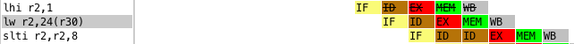

# Report on CAN-PR2
Submitted by Cyril WU, 5132609029, Hugo BI, 5132609036, Nicolas YING, 5030369019.

# 3 Pipelining

## The CPU supports forwarding. 

e.g. Cycle 3, instruction 0x11d8: sw 28(r29), r31 is in EX stage, where r29 isn't yet written back (in MEM stage).


In addtion, it is explicitly shown from the log that a forwarding is done to fetch the computed r29 value for sw instruction.
## Special case for <code>lw</code>

When 0x11ec <code>lw</code> is in EX and MEM stages, <code>slti</code> needs r2 value to enter EX stage, thus this dependency caused a data hazard, solved by a stalling of penalty 1.


## Stages striked out


0x11f0 is actually a misprediction produced at 0x11e8, (it is not actually a prediction since the instuction 0x11e8 is an unconditonal jump).
Thus when 0x11e8 enters EX stage and the CPU spots out that 0x11f0 should not be executed at all, thus it is flushed and the correct instruction is fetched from 0x1098.

Another example could be find here: 


and here:


The latter two was produced by misprediction of conditional branches.

## Difference of the methodology of handling jumps and branches

1. The lecture introduced a processor with dedicated branch prediction, selection and address calculation circuit, while the mocked processor integrates these tasks into ALU.
2. Our binary file have always at least one nop following a (conditional or unconditional) jump, thus we only have to flush one instruction in the case of one misprediction rather than two instructions. This feature could be implemented by the compiler.

# 4. Branch Prediction
## Comparison of two predictors

We compare the performance of 1 bit predictor and 2 bit predictor:

log file of 1 bit predictor
```
INFO  [openDLX]: Jumps correctly predicted: 88 mispredicted: 37 misprediction rate: 29,6%
```

log file of 2 bit predictor
```
INFO  [openDLX]: Jumps correctly predicted: 99 mispredicted: 26 misprediction rate: 20,8%
```

We can see that the number of predictions are both 125 and the 1 bit prediction approach has a higher misprediction rate.

## Detail

1 bit predictor
```
INFO  [openDLX]: bpc: 0x00001078 [120] tgts: [0x00001024] a:44 t/nt: 36/8 mp/cp: 16/28 mp-ratio: 0,36
INFO  [openDLX]: bpc: 0x00001050 [80] tgts: [0x00001060] a:36 t/nt: 31/5 mp/cp: 11/25 mp-ratio: 0,31
INFO  [openDLX]: bpc: 0x000010f4 [116] tgts: [0x000010b4] a:9 t/nt: 8/1 mp/cp: 2/7 mp-ratio: 0,22
INFO  [openDLX]: bpc: 0x000011ac [44] tgts: [0x00001108] a:9 t/nt: 8/1 mp/cp: 2/7 mp-ratio: 0,22
INFO  [openDLX]: bpc: 0x0000101c [28] tgts: [0x0000106c] a:8 t/nt: 8/0 mp/cp: 1/7 mp-ratio: 0,12
INFO  [openDLX]: bpc: 0x00001090 [16] tgts: [0x00001130] a:8 t/nt: 8/0 mp/cp: 1/7 mp-ratio: 0,12
INFO  [openDLX]: bpc: 0x00001128 [40] tgts: [0x00001000] a:8 t/nt: 8/0 mp/cp: 1/7 mp-ratio: 0,12
INFO  [openDLX]: bpc: 0x000010ac [44] tgts: [0x000010ec] a:1 t/nt: 1/0 mp/cp: 1/0 mp-ratio: 1
INFO  [openDLX]: bpc: 0x00001100 [0] tgts: [0x000011a4] a:1 t/nt: 1/0 mp/cp: 1/0 mp-ratio: 1
INFO  [openDLX]: bpc: 0x000011e8 [104] tgts: [0x00001098] a:1 t/nt: 1/0 mp/cp: 1/0 mp-ratio: 1
```
2 bit prodictor
```
INFO  [openDLX]: bpc: 0x00001078 [120] tgts: [0x00001024] a:44 t/nt: 36/8 mp/cp: 9/35 mp-ratio: 0,2
INFO  [openDLX]: bpc: 0x00001050 [80] tgts: [0x00001060] a:36 t/nt: 31/5 mp/cp: 7/29 mp-ratio: 0,19
INFO  [openDLX]: bpc: 0x000010f4 [116] tgts: [0x000010b4] a:9 t/nt: 8/1 mp/cp: 2/7 mp-ratio: 0,22
INFO  [openDLX]: bpc: 0x000011ac [44] tgts: [0x00001108] a:9 t/nt: 8/1 mp/cp: 2/7 mp-ratio: 0,22
INFO  [openDLX]: bpc: 0x0000101c [28] tgts: [0x0000106c] a:8 t/nt: 8/0 mp/cp: 1/7 mp-ratio: 0,12
INFO  [openDLX]: bpc: 0x00001090 [16] tgts: [0x00001130] a:8 t/nt: 8/0 mp/cp: 1/7 mp-ratio: 0,12
INFO  [openDLX]: bpc: 0x00001128 [40] tgts: [0x00001000] a:8 t/nt: 8/0 mp/cp: 1/7 mp-ratio: 0,12
INFO  [openDLX]: bpc: 0x000010ac [44] tgts: [0x000010ec] a:1 t/nt: 1/0 mp/cp: 1/0 mp-ratio: 1
INFO  [openDLX]: bpc: 0x00001100 [0] tgts: [0x000011a4] a:1 t/nt: 1/0 mp/cp: 1/0 mp-ratio: 1
INFO  [openDLX]: bpc: 0x000011e8 [104] tgts: [0x00001098] a:1 t/nt: 1/0 mp/cp: 1/0 mp-ratio: 1
```
When we look at the situation of each branch, we find that the difference bewteen two predictors is more signficant when the branch is executed lots of times. For example, the branch ```0x00001024```. However, 2 bit predictor is not alway better than 1 bit predictor. On branchs ```0x000010b4``` to ```0x00001098```, performences of two predictors are the same.

## Explanation of the difference

```1078:       1440ffea        bnez    v0,1024 <minIndex+0x24>```  
C Code ```<minIndex>: for(i = 0; i < n; i++)```, the condition after for-loop. It is usually taken.

```1050:       10400003        beqz    v0,1060 <minIndex+0x60>```  
C Code ```<minIndex>: if (array[i] < array[minIdx])```, usually taken.

```10f4:       1440ffef        bnez    v0,10b4 <main+0x1c>```  
C Code ```<main>: for(i = 0; i < SIZE; i++)```, the condition after for-loop. It is usually taken.

```11ac:       1440ffd6        bnez    v0,1108 <main+0x70>```  
C Code ```<main>: for(i = 0; i < SIZE; i++)```, the condition after for-loop. It is usually taken.

```101c:       10000013        b       106c <minIndex+0x6c>```  
C code ```<minIndex>: for(i = 0; i < n; i++)```, the condition before for-loop. It is always taken and PC jumps to the condition after for-loop.

```1090:       03e00008        jr      ra```  
C Code ```<minIndex>: return minIndx```, Alway taken.

```1128:       0c000400        jal     1000 <minIndex>```  
C Code ```<main>: minIndex(&buf[i], SIZE - i)```, Always taken.

```10ac:       1000000f        b       10ec <main+0x54>```  
```1100:       10000028        b       11a4 <main+0x10c>```  
C Code ```<main>```: the condition before for-loop. It is usually taken.
   
```11e8:       0c000426        jal     1098 <main>```  
C Code ```<__start>: main()```, Always taken.

The 1 bit predictor do its prediction based on the recent result of the branch. 
We firstly assume that each branch has its own bit, i.e for every branch instruction address, 
a mod k are not equal to other (no collision in hash table).  
The instruction 1078 correspond to the condition of exiting the for-loop in minIndex function. 
Function minIndex is called 8 times in the programme. 
The 1 bit predictor will have a misprediction in the first loop and the last loop, thus we have 16 mispresictions. 
Meanwhile, the 2 bit predictor, at the beginning, has the 2-bit 00. 
In the first two loops, the predictor will not take the branch, because the bit patterns are 00 and 01. 
After that, the predictor will take the branch because of its bit partterns: 11 or 10 
and we can see that the bit pattern will be always 11 and 10. 
So 2 bit predictor will only has one misprediction when exiting the loop, 
added with the first two mispredictions, it has in total 9 mispredictions.

## Penalties  
 
We find that there is always a nop instruction after a conditional jump instruction,
which is, in our opinion, systematically added by the compiler, and the penalties (including the nop added) are:   
PC/Prediction taken/untaken: 3  
PC/Prediction taken/taken: 2  
PC/Prediction untaken/taken: 3  
PC/Prediction untaken/untaken: 2  

Because there is a nop after condition, CPU only need to flush when a misprediction occur. In addition, CPU has the same behavier after a taken/untaken or a untaken/taken, which could simplfy the design.

# 5 Data Caches

## memory_latency

We give a delay time between the memory's receipt of a read request and its release of data corresponding with the request. So the IF, MEM and WB will have delay in the pipelining.
Other stages will also have delays for the data dependency.


```
Dcache: 
Accesses: 500  hits: 220  misses: 280  hit rate: 44%  total size: 16
```

## dcache_total_block_number

dcache_total_block_number = 4
```
Dcache: 
total size: 16
Accesses: 500 hits: 220 misses: 280 hit rate: 44%
```
dcache_total_block_number = 8
```
Dcache: 
total size: 32
Accesses: 499 hits: 381 misses: 118 hit rate: 76.35%
```

dcache_total_block_number = 16
```
Dcache:
total size: 64
Accesses: 500 hits: 411 misses: 89 hit rate: 82.2% 
```

dcache_total_block_number = 32
```
Dcache: 
total size: 128
Accesses: 500 hits: 492 misses: 8 hit rate: 98.4%
```

dcache_total_block_number = 64
```
Dcache:
total size: 256
Accesses: 500 hits: 492 misses: 8 hit rate: 98.4% 
```

Conclusion:

The cache size is changed from 16 to 256, and the hit rate has a continuous growth. With regard to the cache size, the case when  dcache_total_block_number = 32 performs best.

## dcache_associativity with dcache_total_block_number = 8

dcache_associativity = 2, dacache_replacement_policy = FIFO
```
Dcache:
hit rate: 74.55%
```

dcache_associativity = 2, dacache_replacement_policy = LRU
```
Dcache:
hit rate: 77.35%
```
dcache_associativity = 4, dacache_replacement_policy = FIFO
```
Dcache:
total size: 32
rate: 83.97%
```

dcache_associativity = 4, dacache_replacement_policy = LRU
```
Dcache:
total size: 32
hit rate: 85.97%
```

dcache_associativity = 8, dacache_replacement_policy = FIFO
```
Dcache:
total size: 32
hit rate: 83.37%
```
dcache_associativity = 8, dacache_replacement_policy = LRU
```
Dcache:
total size: 32
hit rate: 87.58%
```
dcache_associativity = 1, dacache_replacement_policy = DIRECT_MAPPED

```
Dcache:
total size: 32
hit rate: 76.35%
```

Conclusion:

The two replacement policies with a higher data cache associativity have better performances than the original DIRECT_MAPPED with the same total size in general.

## dcache_block_size with LRU 4 way associativity and dcache_total_block_number = 8

dcache_block_size = 4
```
total size: 32
hit rate: 85.97%
```
dcache_block_size = 8
```
total size: 64
hit rate: 96.8% 
```
dcache_block_size = 16	
```
total size: 128
hit rate: 99.6%
```
dcache_block_size = 32
```
total size: 256
hit rate: 99.6%
```
Conclusion:

Compared with block number section, the scheme to increase the block size has better performance than the scheme to increase the block number, with the same total cache size.

## C code examination

The data are accessed by the program in array buf and in counters (spatial locality and temporal locality), so the data is reused frequently.

The capacity miss dominates the cache's performance in this program because the data used is very fixed.

The program actually access the data:

1. in main, SIZE numbers to sort: buf[SIZE]

2. in main, counter i

3. in main, the temporary variable: tmp and minIdx

4. in minIndex, the local variable: i and minIdx

   in total 8+1+2+2 = 13.

Practically, a cache that is large enough to contain 8 integers (32 cache size units) would provide a promising hit rate as they are the most frequently used data.
In addition, if a data cache is large enough to cache all the data accessed, data miss would only be generated the first time it is accessed.

## Final question

The configuration dcache_block_size = 16/32, 4-way set-associative, total number of cache blocks = 8 performs the best (the hit rate 99.6% exceeds all the others cases).

The configuration:  dcache_block_size = 8, 4-way set-associative, total number of cache blocks = 8 made the best trade-off between the total cache size and the hit rate. Because the hit rate is rather good and close to 100% (96.8%), but the total cache size is merely half of the best performance case(the case total size = 128, hit rate = 99.6%) in block size section. 

From the result of changing data cache number and size, we can observe that as the total size increase, the hit rate is significantly enhanced, and from question 4 that as the total cache size is fixed, the enhance of hit rate is limited. So we can conclude that the total cache size is the most relevant parameter to the hit rate. And this conclusion is coherent with the analysis of data access that the data is reused very frequently and the most dominant factor of the hit rate is the cache size.

# 2 Warm Up 
## 2.1 MIPS Tools
## Compile insertion-sort.c
```
bin/insertion-sort.elf: src/insertion-sort.c
	$(MIPS_CC) $(MIPS_CFLAGS) -o $@ $<

bin/insertion-sort.bin: bin/insertion-sort.elf
	$(MIPS_OBJCPY) -O binary -S $< $@

cfg/*.cfg: bin/insertion-sort.elf
    bin/updatecfgFiles.sh $< ./cfg > /dev/null 2>&1
```
##  -nostdlib and -nostartfiles
```
-nostdlib
          Do not use the standard system startup files or libraries when linking.  No startup files and only the
          libraries you specify will be passed to the linker, options specifying linkage of the system libraries,
          such as "-static-libgcc" or "-shared-libgcc", will be ignored.  The compiler may generate calls to
          "memcmp", "memset", "memcpy" and "memmove".  These entries are usually resolved by entries in libc.
          These entry points should be supplied through some other mechanism when this option is specified.

          One of the standard libraries bypassed by -nostdlib and -nodefaultlibs is libgcc.a, a library of
          internal subroutines which GCC uses to overcome shortcomings of particular machines, or special needs
          for some languages.

          In most cases, you need libgcc.a even when you want to avoid other standard libraries.  In other words,
          when you specify -nostdlib or -nodefaultlibs you should usually specify -lgcc as well.  This ensures
          that you have no unresolved references to internal GCC library subroutines.  (For example, __main, used
          to ensure C++ constructors will be called.)

-nostdlib
          Do not use the standard system startup files or libraries when linking.  No startup files and only the
          libraries you specify will be passed to the linker, options specifying linkage of the system libraries,
          such as "-static-libgcc" or "-shared-libgcc", will be ignored.  The compiler may generate calls to
          "memcmp", "memset", "memcpy" and "memmove".  These entries are usually resolved by entries in libc.
          These entry points should be supplied through some other mechanism when this option is specified.

          One of the standard libraries bypassed by -nostdlib and -nodefaultlibs is libgcc.a, a library of
          internal subroutines which GCC uses to overcome shortcomings of particular machines, or special needs
          for some languages.

          In most cases, you need libgcc.a even when you want to avoid other standard libraries.  In other words,
          when you specify -nostdlib or -nodefaultlibs you should usually specify -lgcc as well.  This ensures
          that you have no unresolved references to internal GCC library subroutines.  (For example, __main, used
          to ensure C++ constructors will be called.)
```
## look at the assembly code
```
sjtu@sjtu-OptiPlex-3010:~/Documents/DossierNicolasien/PR2$ mips-linux-gnu-objdump -d bin/insertion-sort.elf 

bin/insertion-sort.elf:     file format elf32-tradlittlemips


Disassembly of section .text:

00001000 <minIndex>:
   1000:       27bdffe8        addiu   sp,sp,-24
   1004:       afbe0014        sw      s8,20(sp)
   1008:       03a0f025        move    s8,sp
   100c:       afc40018        sw      a0,24(s8)
   1010:       afc5001c        sw      a1,28(s8)
   1014:       afc0000c        sw      zero,12(s8)
   1018:       afc00008        sw      zero,8(s8)
   101c:       10000013        b       106c <minIndex+0x6c>
   1020:       00000000        nop
   1024:       8fc20008        lw      v0,8(s8)
   1028:       00021080        sll     v0,v0,0x2
   102c:       8fc30018        lw      v1,24(s8)
   1030:       00621021        addu    v0,v1,v0
   1034:       8c430000        lw      v1,0(v0)
   1038:       8fc2000c        lw      v0,12(s8)
   103c:       00021080        sll     v0,v0,0x2
   1040:       8fc40018        lw      a0,24(s8)
   1044:       00821021        addu    v0,a0,v0
   1048:       8c420000        lw      v0,0(v0)
   104c:       0062102a        slt     v0,v1,v0
   1050:       10400003        beqz    v0,1060 <minIndex+0x60>
   1054:       00000000        nop
   1058:       8fc20008        lw      v0,8(s8)
   105c:       afc2000c        sw      v0,12(s8)
   1060:       8fc20008        lw      v0,8(s8)
   1064:       24420001        addiu   v0,v0,1
   1068:       afc20008        sw      v0,8(s8)
   106c:       8fc30008        lw      v1,8(s8)
   1070:       8fc2001c        lw      v0,28(s8)
   1074:       0062102a        slt     v0,v1,v0
   1078:       1440ffea        bnez    v0,1024 <minIndex+0x24>
   107c:       00000000        nop
   1080:       8fc2000c        lw      v0,12(s8)
   1084:       03c0e825        move    sp,s8
   1088:       8fbe0014        lw      s8,20(sp)
   108c:       27bd0018        addiu   sp,sp,24
   1090:       03e00008        jr      ra
   1094:       00000000        nop

00001098 <main>:
   1098:       27bdffb0        addiu   sp,sp,-80
   109c:       afbf004c        sw      ra,76(sp)
   10a0:       afbe0048        sw      s8,72(sp)
   10a4:       03a0f025        move    s8,sp
   10a8:       afc00018        sw      zero,24(s8)
   10ac:       1000000f        b       10ec <main+0x54>
   10b0:       00000000        nop
   10b4:       3c020001        lui     v0,0x1
   10b8:       8fc30018        lw      v1,24(s8)
   10bc:       00031880        sll     v1,v1,0x2
   10c0:       24421210        addiu   v0,v0,4624
   10c4:       00621021        addu    v0,v1,v0
   10c8:       8c430000        lw      v1,0(v0)
   10cc:       8fc20018        lw      v0,24(s8)
   10d0:       00021080        sll     v0,v0,0x2
   10d4:       27c40018        addiu   a0,s8,24
   10d8:       00821021        addu    v0,a0,v0
   10dc:       ac43000c        sw      v1,12(v0)
   10e0:       8fc20018        lw      v0,24(s8)
   10e4:       24420001        addiu   v0,v0,1
   10e8:       afc20018        sw      v0,24(s8)
   10ec:       8fc20018        lw      v0,24(s8)
   10f0:       28420008        slti    v0,v0,8
   10f4:       1440ffef        bnez    v0,10b4 <main+0x1c>  
   10f8:       00000000        nop
   10fc:       afc00018        sw      zero,24(s8)
   1100:       10000028        b       11a4 <main+0x10c>
   1104:       00000000        nop
   1108:       27c30024        addiu   v1,s8,36
   110c:       8fc20018        lw      v0,24(s8)
   1110:       00021080        sll     v0,v0,0x2
   1114:       00622021        addu    a0,v1,v0
   1118:       24030008        li      v1,8
   111c:       8fc20018        lw      v0,24(s8)
   1120:       00621023        subu    v0,v1,v0
   1124:       00402825        move    a1,v0
   1128:       0c000400        jal     1000 <minIndex>
   112c:       00000000        nop
   1130:       00401825        move    v1,v0
   1134:       8fc20018        lw      v0,24(s8)
   1138:       00621021        addu    v0,v1,v0
   113c:       afc2001c        sw      v0,28(s8)
   1140:       8fc2001c        lw      v0,28(s8)
   1144:       00021080        sll     v0,v0,0x2
   1148:       27c30018        addiu   v1,s8,24
   114c:       00621021        addu    v0,v1,v0
   1150:       8c42000c        lw      v0,12(v0)
   1154:       afc20020        sw      v0,32(s8)
   1158:       8fc20018        lw      v0,24(s8)
   115c:       00021080        sll     v0,v0,0x2
   1160:       27c30018        addiu   v1,s8,24
   1164:       00621021        addu    v0,v1,v0
   1168:       8c43000c        lw      v1,12(v0)
   116c:       8fc2001c        lw      v0,28(s8)
   1170:       00021080        sll     v0,v0,0x2
   1174:       27c40018        addiu   a0,s8,24
   1178:       00821021        addu    v0,a0,v0
   117c:       ac43000c        sw      v1,12(v0)
   1180:       8fc20018        lw      v0,24(s8)
   1184:       00021080        sll     v0,v0,0x2
   1188:       27c30018        addiu   v1,s8,24
   118c:       00621021        addu    v0,v1,v0
   1190:       8fc30020        lw      v1,32(s8)
   1194:       ac43000c        sw      v1,12(v0)
   1198:       8fc20018        lw      v0,24(s8)
   119c:       24420001        addiu   v0,v0,1
   11a0:       afc20018        sw      v0,24(s8)
   11a4:       8fc20018        lw      v0,24(s8)
   11a8:       28420008        slti    v0,v0,8
   11ac:       1440ffd6        bnez    v0,1108 <main+0x70>
   11b0:       00000000        nop
   11b4:       0000000d        break
   11b8:       8fc20024        lw      v0,36(s8)
   11bc:       03c0e825        move    sp,s8
   11c0:       8fbf004c        lw      ra,76(sp)
   11c4:       8fbe0048        lw      s8,72(sp)
   11c8:       27bd0050        addiu   sp,sp,80
   11cc:       03e00008        jr      ra
   11d0:       00000000        nop

000011d4 <__start>:
   11d4:       27bdffe0        addiu   sp,sp,-32
   11d8:       afbf001c        sw      ra,28(sp)
   11dc:       afbe0018        sw      s8,24(sp)
   11e0:       03a0f025        move    s8,sp
   11e4:       3c1d0f00        lui     sp,0xf00
   11e8:       0c000426        jal     1098 <main>
   11ec:       00000000        nop
   11f0:       00000000        nop
   11f4:       03c0e825        move    sp,s8
   11f8:       8fbf001c        lw      ra,28(sp)
   11fc:       8fbe0018        lw      s8,24(sp)
   1200:       27bd0020        addiu   sp,sp,32
   1204:       03e00008        jr      ra
   1208:       00000000        nop
   120c:       00000000        nop
```
## look at the code + .c
```
sjtu@sjtu-OptiPlex-3010:~/Documents/DossierNicolasien/PR2$ mips-linux-gnu-objdump -S bin/insertion-sort.elf 

bin/insertion-sort.elf:     file format elf32-tradlittlemips


Disassembly of section .text:

00001000 <minIndex>:
#define SIZE 8

int input[] = {60, 41, 46, 50, 44, 3, 84, 80, 55, 57, 91, 22, 21, 12, 64, 59, 71, 34, 81, 77, 69, 95, 2, 24, 61, 73, 25, 19, 29, 91, 45, 53, 39, 15, 47, 58, 3, 62, 81, 0, 33, 83, 12, 64, 75, 59, 32, 68, 98, 68, 53, 74, 88, 30, 65, 23, 97, 66, 49, 46, 18, 22, 0, 30, 3, 33, 13, 33, 31, 61, 14, 87, 57, 95, 20, 92, 67, 71, 42, 52, 18, 98, 2, 93, 95, 69, 90, 8, 97, 46, 26, 68, 69, 84, 73, 35, 44, 88, 79, 65};

int minIndex(int *array, int n)
{
   1000:       27bdffe8        addiu   sp,sp,-24
   1004:       afbe0014        sw      s8,20(sp)
   1008:       03a0f025        move    s8,sp
   100c:       afc40018        sw      a0,24(s8)
   1010:       afc5001c        sw      a1,28(s8)
       int i,minIdx = 0;
   1014:       afc0000c        sw      zero,12(s8)
       for(i = 0; i < n; i++)
   1018:       afc00008        sw      zero,8(s8)
   101c:       10000013        b       106c <minIndex+0x6c>
   1020:       00000000        nop
       {
               if (array[i] < array[minIdx])
   1024:       8fc20008        lw      v0,8(s8)
   1028:       00021080        sll     v0,v0,0x2
   102c:       8fc30018        lw      v1,24(s8)
   1030:       00621021        addu    v0,v1,v0
   1034:       8c430000        lw      v1,0(v0)
   1038:       8fc2000c        lw      v0,12(s8)
   103c:       00021080        sll     v0,v0,0x2
   1040:       8fc40018        lw      a0,24(s8)
   1044:       00821021        addu    v0,a0,v0
   1048:       8c420000        lw      v0,0(v0)
   104c:       0062102a        slt     v0,v1,v0
   1050:       10400003        beqz    v0,1060 <minIndex+0x60>
   1054:       00000000        nop
               {
                       minIdx = i;
   1058:       8fc20008        lw      v0,8(s8)
   105c:       afc2000c        sw      v0,12(s8)
int input[] = {60, 41, 46, 50, 44, 3, 84, 80, 55, 57, 91, 22, 21, 12, 64, 59, 71, 34, 81, 77, 69, 95, 2, 24, 61, 73, 25, 19, 29, 91, 45, 53, 39, 15, 47, 58, 3, 62, 81, 0, 33, 83, 12, 64, 75, 59, 32, 68, 98, 68, 53, 74, 88, 30, 65, 23, 97, 66, 49, 46, 18, 22, 0, 30, 3, 33, 13, 33, 31, 61, 14, 87, 57, 95, 20, 92, 67, 71, 42, 52, 18, 98, 2, 93, 95, 69, 90, 8, 97, 46, 26, 68, 69, 84, 73, 35, 44, 88, 79, 65};

int minIndex(int *array, int n)
{
       int i,minIdx = 0;
       for(i = 0; i < n; i++)
   1060:       8fc20008        lw      v0,8(s8)
   1064:       24420001        addiu   v0,v0,1
   1068:       afc20008        sw      v0,8(s8)
   106c:       8fc30008        lw      v1,8(s8)
   1070:       8fc2001c        lw      v0,28(s8)
   1074:       0062102a        slt     v0,v1,v0
   1078:       1440ffea        bnez    v0,1024 <minIndex+0x24>
   107c:       00000000        nop
               {
                       minIdx = i;
               }
       }

       return minIdx;
   1080:       8fc2000c        lw      v0,12(s8)
}
   1084:       03c0e825        move    sp,s8
   1088:       8fbe0014        lw      s8,20(sp)
   108c:       27bd0018        addiu   sp,sp,24
   1090:       03e00008        jr      ra
   1094:       00000000        nop

00001098 <main>:

int main()
{
   1098:       27bdffb0        addiu   sp,sp,-80 // r29, r29, -80 ?
   109c:       afbf004c        sw      ra,76(sp) // 76(r29), r31
   10a0:       afbe0048        sw      s8,72(sp) // 72(r29), r31
   10a4:       03a0f025        move    s8,sp // or r30, r29, r0
       int buf[SIZE];
       int i;

       for(i = 0; i < SIZE; i++)
   10a8:       afc00018        sw      zero,24(s8) // sw 24(r30), r0
   10ac:       1000000f        b       10ec <main+0x54> // beqz r0, 0x3c, jump
   10b0:       00000000        nop
       {
               buf[i] = input[i];
   10b4:       3c020001        lui     v0,0x1 // v0 = 1 << 16?
   10b8:       8fc30018        lw      v1,24(s8) // v1: input[i], s8: 
   10bc:       00031880        sll     v1,v1,0x2 // v1 *= 4
   10c0:       24421210        addiu   v0,v0,4624 // 4624 offset ?
   10c4:       00621021        addu    v0,v1,v0 // v0 += 
   10c8:       8c430000        lw      v1,0(v0) // v1 = v0
   10cc:       8fc20018        lw      v0,24(s8) // v0 = i
   10d0:       00021080        sll     v0,v0,0x2 // v0 = 4i
   10d4:       27c40018        addiu   a0,s8,24 // s8 = a0 + 24
   10d8:       00821021        addu    v0,a0,v0 // v0 = v0 + a0 ?
   10dc:       ac43000c        sw      v1,12(v0) // M[v0 + 12] = v1 -> loading in to memory, v0 = 0xeffffc8+4k
int main()
{
       int buf[SIZE];
       int i;

       for(i = 0; i < SIZE; i++)
   10e0:       8fc20018        lw      v0,24(s8) // i
   10e4:       24420001        addiu   v0,v0,1 // i++
   10e8:       afc20018        sw      v0,24(s8) 
   10ec:       8fc20018        lw      v0,24(s8) // i load from memory?
   10f0:       28420008        slti    v0,v0,8 // i < 8 ?
   10f4:       1440ffef        bnez    v0,10b4 <main+0x1c> 
   10f8:       00000000        nop
       {
               buf[i] = input[i];
       }

       for(i = 0; i < SIZE; i++)
   10fc:       afc00018        sw      zero,24(s8)
   1100:       10000028        b       11a4 <main+0x10c>
   1104:       00000000        nop
       {
               int minIdx = i + minIndex(&buf[i], SIZE - i);
   1108:       27c30024        addiu   v1,s8,36
   110c:       8fc20018        lw      v0,24(s8)
   1110:       00021080        sll     v0,v0,0x2
   1114:       00622021        addu    a0,v1,v0
   1118:       24030008        li      v1,8
   111c:       8fc20018        lw      v0,24(s8)
   1120:       00621023        subu    v0,v1,v0
   1124:       00402825        move    a1,v0
   1128:       0c000400        jal     1000 <minIndex>
   112c:       00000000        nop
   1130:       00401825        move    v1,v0
   1134:       8fc20018        lw      v0,24(s8)
   1138:       00621021        addu    v0,v1,v0
   113c:       afc2001c        sw      v0,28(s8)
               int tmp = buf[minIdx];
   1140:       8fc2001c        lw      v0,28(s8)
   1144:       00021080        sll     v0,v0,0x2
   1148:       27c30018        addiu   v1,s8,24
   114c:       00621021        addu    v0,v1,v0
   1150:       8c42000c        lw      v0,12(v0)
   1154:       afc20020        sw      v0,32(s8)
               buf[minIdx] = buf[i];
   1158:       8fc20018        lw      v0,24(s8)
   115c:       00021080        sll     v0,v0,0x2
   1160:       27c30018        addiu   v1,s8,24
   1164:       00621021        addu    v0,v1,v0
   1168:       8c43000c        lw      v1,12(v0)
   116c:       8fc2001c        lw      v0,28(s8)
   1170:       00021080        sll     v0,v0,0x2
   1174:       27c40018        addiu   a0,s8,24
   1178:       00821021        addu    v0,a0,v0
   117c:       ac43000c        sw      v1,12(v0)
               buf[i] = tmp;
   1180:       8fc20018        lw      v0,24(s8)
   1184:       00021080        sll     v0,v0,0x2
   1188:       27c30018        addiu   v1,s8,24
   118c:       00621021        addu    v0,v1,v0
   1190:       8fc30020        lw      v1,32(s8)
   1194:       ac43000c        sw      v1,12(v0)
       for(i = 0; i < SIZE; i++)
       {
               buf[i] = input[i];
       }

       for(i = 0; i < SIZE; i++)
   1198:       8fc20018        lw      v0,24(s8)
   119c:       24420001        addiu   v0,v0,1
   11a0:       afc20018        sw      v0,24(s8)
   11a4:       8fc20018        lw      v0,24(s8)
   11a8:       28420008        slti    v0,v0,8
   11ac:       1440ffd6        bnez    v0,1108 <main+0x70>
   11b0:       00000000        nop
               int tmp = buf[minIdx];
               buf[minIdx] = buf[i];
               buf[i] = tmp;
       }

       asm volatile ("break");
   11b4:       0000000d        break
       return buf[0];
   11b8:       8fc20024        lw      v0,36(s8)
}
   11bc:       03c0e825        move    sp,s8
   11c0:       8fbf004c        lw      ra,76(sp)
   11c4:       8fbe0048        lw      s8,72(sp)
   11c8:       27bd0050        addiu   sp,sp,80
   11cc:       03e00008        jr      ra
   11d0:       00000000        nop

000011d4 <__start>:

void __start()
{
   11d4:       27bdffe0        addiu   sp,sp,-32
   11d8:       afbf001c        sw      ra,28(sp)
   11dc:       afbe0018        sw      s8,24(sp)
   11e0:       03a0f025        move    s8,sp
 asm volatile ("lui $sp, 0xf00");
   11e4:       3c1d0f00        lui     sp,0xf00
 main();
   11e8:       0c000426        jal     1098 <main>
   11ec:       00000000        nop
 // does not return
}
   11f0:       00000000        nop
   11f4:       03c0e825        move    sp,s8
   11f8:       8fbf001c        lw      ra,28(sp)
   11fc:       8fbe0018        lw      s8,24(sp)
   1200:       27bd0020        addiu   sp,sp,32
   1204:       03e00008        jr      ra
   1208:       00000000        nop
   120c:       00000000        nop
```
## Symbols in 
```
sjtu@sjtu-OptiPlex-3010:~/Documents/DossierNicolasien/PR2$ mips-linux-gnu-objdump -t -j.data -j.text bin/insertion-sort.elf

bin/insertion-sort.elf:     file format elf32-tradlittlemips

SYMBOL TABLE:
00001000 l    d  .text  00000000 .text
00011210 l    d  .data  00000000 .data
00011210 g       .data  00000000 _fdata
00011210 g     O .data  00000190 input
000011d4 g     F .text  00000038 __start
00001000 g       .text  00000000 _ftext
000113a0 g       .data  00000000 __bss_start
00001098 g     F .text  0000013c main
000113a0 g       .data  00000000 _edata
000113a0 g       .data  00000000 _end
00001000 g     F .text  00000098 minIndex
000113a0 g       .data  00000000 _fbss
```
Symbol for INPUT in C code :
```
00011210 l    d  .data  00000000 .data
00011210 g       .data  00000000 _fdata
00011210 g     O .data  00000190 input
```
## Loading address of input into register.

```
for(i = 0; i < SIZE; i++)
   10e0:       8fc20018        lw      v0,24(s8)
   10e4:       24420001        addiu   v0,v0,1
   10e8:       afc20018        sw      v0,24(s8)
   10ec:       8fc20018        lw      v0,24(s8)
   10f0:       28420008        slti    v0,v0,8
   10f4:       1440ffef        bnez    v0,10b4 <main+0x1c>
   10f8:       00000000        nop
       {
               buf[i] = input[i];
       }
```

## 2.2 openDLX

## Checking 0x11210, match against input array
0x3c => 60_(10), ox29 => 41 ...

## determine the address to which the store instruction is writing

0x8fc20018 100011 | 11 110 | 0 0010 | 0000 0000 0001 1000
rt = 2, rs = 30, imm = 24

## Values in memory are sirted

## 9 cycles misprediction

11e8:       0c000426        jal     1098 <main>

an unconditional branch jump

## Statistics
```
-------- SIMULATION STATISTICS --------
Cycles: 9
Executed instructions: 6
Performed fetches: 9
Cache statistics:
Icache: used rpol: DIRECT_MAPPED lines: 32 associativity: 1 line_size: 8 total size: 256
Accesses:9 hits: 3 misses: 6 hit rate: 33,33% loaded words: 12
Dcache: used rpol: DIRECT_MAPPED wpol: WRITE_THROUGH lines: 4 associativity: 1 line_size: 4 total size: 16
Accesses: 0 hits: 0 misses: 0 loaded words: 0
Jumps: 1 (taken: 1, not taken: 0) branches_likely: 0 branches_and_link: 1
Branch Target Buffer (128, D_1BIT): hits: 0 misses: 1
Jumps correctly predicted: 0 mispredicted: 1 misprediction rate: 100%
Number of unique jumps: 1
bpc: 0x000011e8 [104] tgts: [0x00001098] a:1 t/nt: 1/0 mp/cp: 1/0 mp-ratio: 1
Memory accesses: 2 (reads: 0, writes: 2)
ALU forwarded values: 3 (from execute: 3, memory stage: 0, write back: 0)
BCRTL forwarded values: 0 (from execute: 0, memory stage: 0, write back: 0)
STORE forwarded values: 0 (from execute: 0, memory stage: 0, write back: 0)
Total forwarded values: 3 (from execute: 3, memory stage: 0, write back: 0)
-------- SIMULATION STATISTICS --------
```

## After the execution
```
-------- SIMULATION STATISTICS --------
Cycles: 1868
Executed instructions: 1441
Performed fetches: 1868
Cache statistics:
Icache: used rpol: DIRECT_MAPPED lines: 32 associativity: 1 line_size: 8 total size: 256
Accesses:1868 hits: 1558 misses: 310 hit rate: 83,4% loaded words: 620
Dcache: used rpol: DIRECT_MAPPED wpol: WRITE_THROUGH lines: 4 associativity: 1 line_size: 4 total size: 16
Accesses: 500 hits: 220 misses: 280 hit rate: 44% loaded words: 280
Jumps: 125 (taken: 110, not taken: 15) branches_likely: 0 branches_and_link: 9
Branch Target Buffer (128, D_1BIT): hits: 115 misses: 10
Jumps correctly predicted: 88 mispredicted: 37 misprediction rate: 29,6%
Number of unique jumps: 10
bpc: 0x00001078 [120] tgts: [0x00001024] a:44 t/nt: 36/8 mp/cp: 16/28 mp-ratio: 0,36
bpc: 0x00001050 [80] tgts: [0x00001060] a:36 t/nt: 31/5 mp/cp: 11/25 mp-ratio: 0,31
bpc: 0x000010f4 [116] tgts: [0x000010b4] a:9 t/nt: 8/1 mp/cp: 2/7 mp-ratio: 0,22
bpc: 0x000011ac [44] tgts: [0x00001108] a:9 t/nt: 8/1 mp/cp: 2/7 mp-ratio: 0,22
bpc: 0x0000101c [28] tgts: [0x0000106c] a:8 t/nt: 8/0 mp/cp: 1/7 mp-ratio: 0,12
bpc: 0x00001090 [16] tgts: [0x00001130] a:8 t/nt: 8/0 mp/cp: 1/7 mp-ratio: 0,12
bpc: 0x00001128 [40] tgts: [0x00001000] a:8 t/nt: 8/0 mp/cp: 1/7 mp-ratio: 0,12
bpc: 0x000010ac [44] tgts: [0x000010ec] a:1 t/nt: 1/0 mp/cp: 1/0 mp-ratio: 1
bpc: 0x00001100 [0] tgts: [0x000011a4] a:1 t/nt: 1/0 mp/cp: 1/0 mp-ratio: 1
bpc: 0x000011e8 [104] tgts: [0x00001098] a:1 t/nt: 1/0 mp/cp: 1/0 mp-ratio: 1
Memory accesses: 643 (reads: 500, writes: 143)
ALU forwarded values: 994 (from execute: 957, memory stage: 37, write back: 0)
BCRTL forwarded values: 95 (from execute: 88, memory stage: 7, write back: 0)
STORE forwarded values: 102 (from execute: 101, memory stage: 1, write back: 0)
Total forwarded values: 1191 (from execute: 1146, memory stage: 45, write back: 0)
-------- SIMULATION STATISTICS --------
```